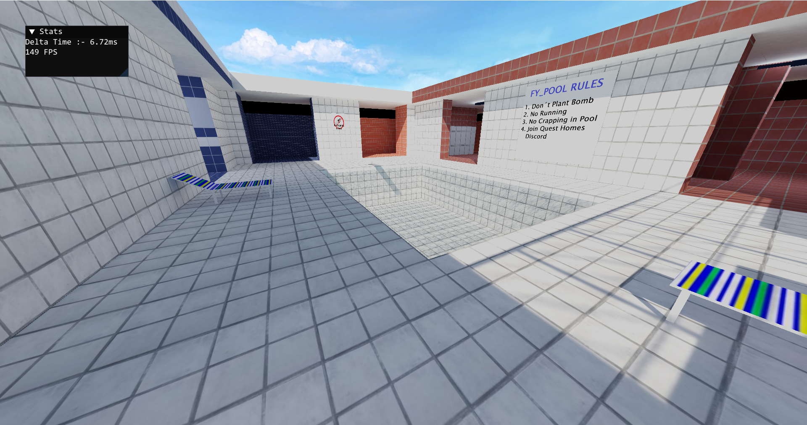

# FPSDemo

This is a small, first person shooter styled, demo game. It is made in C++ with OpenGL.
Currently under development. This is the first game of ThriverStudios.

## Technical details

 - Uses CMake as the buildsystem
 - Uses C++ as the programming language
 - Uses OpenGL 4.6 core profile as the graphics API
 - The GPU must have the extension `GL_EXT_texture_filter_anisotropic` because anisotropic filtering is mandatory

## Platform and compiler support

 - Compilers
    - [x] GNU GCC/G++ (Developed on G++ 14.1.0)
    - [x] MSVC (latest)
    - [ ] LLVM Clang & Clang++ (latest)
 - Platform
    - [x] Desktop
 - OS
    - [x] Windows 10
    - [ ] Windows 11
    - [ ] Linux

## Glimpses

 
